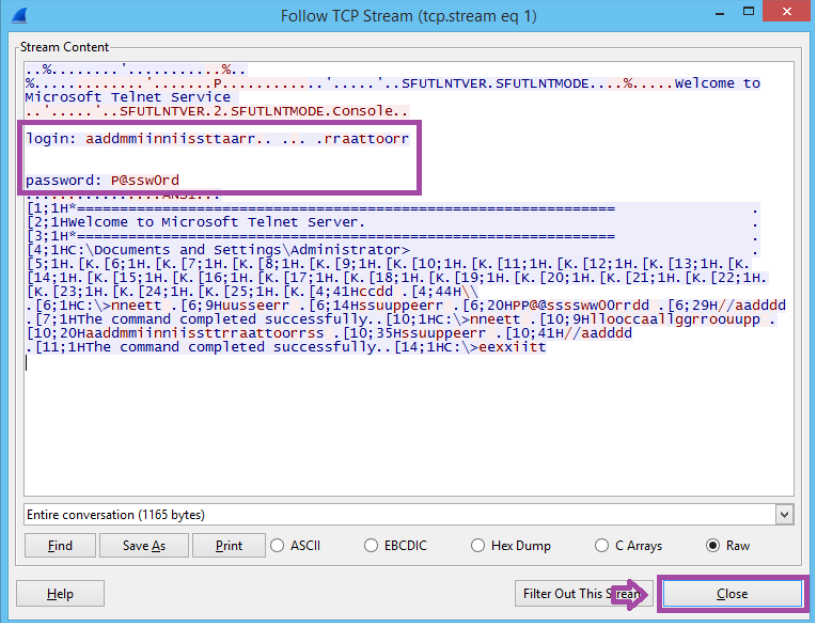
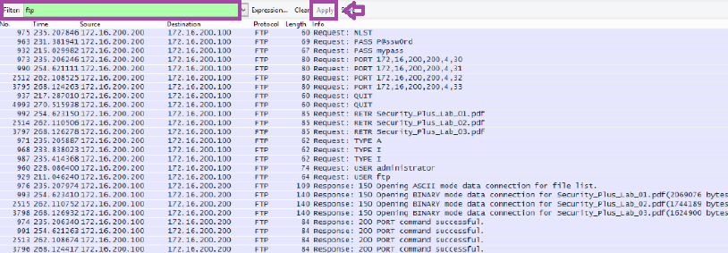
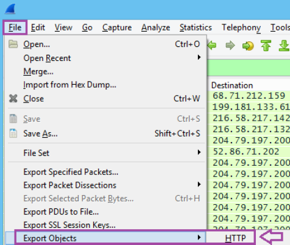
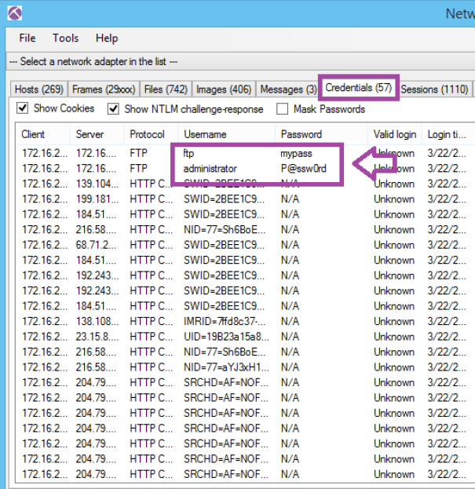
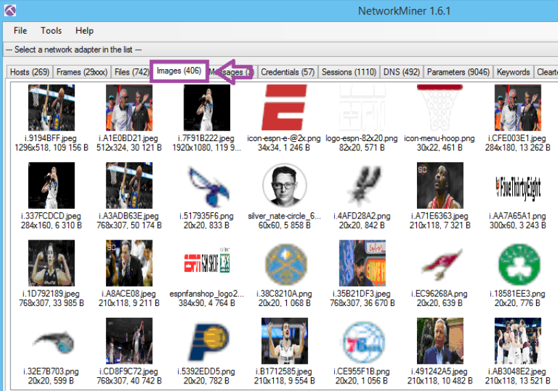
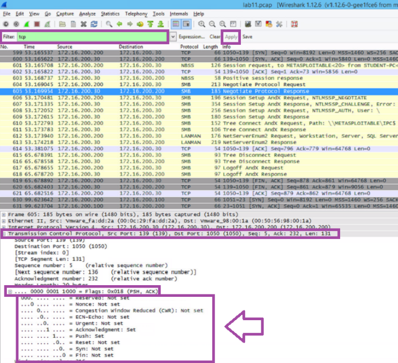

# Network Traffic and Protocol Analysis Investigation


---

## Threat Overview

This investigation focused on analyzing packet capture (PCAP) data to identify insecure protocols, exposed credentials, suspicious network activity, and forensic artifacts.

The lab simulated a real-world network investigation workflow involving protocol filtering, traffic inspection, credential exposure analysis, and artifact extraction.

---

# MITRE ATT&CK Mapping

| Technique | ID | Tactic |
|---|---|---|
| Network Sniffing | T1040 | Credential Access |
| Unsecured Credentials | T1552 | Credential Access |
| Remote Services | T1021 | Lateral Movement |

---

# Investigation Methodology

1. Initial packet capture review
2. Protocol-based traffic filtering
3. TCP stream analysis
4. Credential exposure investigation
5. Artifact extraction and forensic review
6. Network visibility assessment
7. Detection and security recommendation development

---

# Tools Used

| Tool | Purpose |
|---|---|
| Wireshark | Packet analysis and protocol inspection |
| NetworkMiner | Network forensic artifact extraction |
| Kali Linux | Investigation environment |

---

# Environment

| Component | Details |
|---|---|
| Platform | VMware |
| Operating System | Kali Linux / Windows |
| Primary Tool | Wireshark |
| Secondary Tool | NetworkMiner |
| File Type | PCAP |

---

# Protocols Analyzed

- TCP
- UDP
- HTTP
- FTP
- TELNET
- SMTP
- POP3
- DNS
- SMB
- NBNS

---

# Technical Findings

## Key Security Findings

### Plaintext Credential Exposure

TELNET, FTP, and POP3 traffic exposed usernames and passwords in plaintext.

### Insecure Protocol Usage

Multiple legacy protocols were identified transmitting sensitive data without encryption.

### Artifact Exposure

Network traffic contained recoverable images, files, and forensic artifacts.

### Internal Network Visibility

Packet analysis revealed internal communication behavior and service interactions.

---

## Investigation Evidence

### Plaintext Credential Exposure via TELNET

TELNET traffic analysis revealed plaintext authentication activity inside the TCP stream. Usernames and passwords were observable without encryption.



---

### FTP Traffic and File Transfer Analysis

FTP protocol traffic was analyzed to review authentication behavior, file transfers, and insecure protocol usage.



---

### HTTP Object Extraction Workflow

Wireshark HTTP object export functionality was used to identify recoverable web artifacts transferred across the network.



---

### NetworkMiner Credential Analysis

NetworkMiner extracted authentication artifacts and credentials directly from packet capture traffic.



---

### NetworkMiner Image Artifact Analysis

Recovered image artifacts demonstrated how unencrypted traffic may expose transferred content and forensic evidence.



---

### TCP Flag and Session Analysis

TCP session analysis was performed to review packet behavior, ACK/PSH flags, and communication patterns during the investigation.



---

# Detection Recommendations

## Security Improvements

- Replace TELNET with SSH
- Replace FTP with SFTP or SCP
- Enforce encrypted communication protocols
- Monitor abnormal authentication activity
- Implement network segmentation
- Restrict insecure legacy services

---

# Security Impact

Organizations using insecure protocols risk exposure of:

- usernames
- passwords
- internal IP addresses
- transferred files
- e-mail communications
- sensitive network metadata

Packet captures may contain valuable intelligence for attackers if improperly handled.

---

# Skills Demonstrated

- Network Traffic Analysis
- Packet Inspection
- Protocol Filtering
- TCP Stream Analysis
- Credential Exposure Investigation
- Artifact Extraction
- Threat Investigation
- Defensive Security Analysis
- Network Forensics
- Security Documentation

---

# Key Takeaways

This investigation demonstrated how insecure protocols can expose sensitive authentication data and forensic artifacts during network communications.

The analysis also highlighted the importance of encrypted protocols, traffic monitoring, and packet-level visibility during security investigations.

---

# Repository Structure

```text
.
├── evidence
├── findings
├── iocs
├── reports
├── screenshots
│   ├── artifact-analysis
│   ├── credential-analysis
│   ├── protocol-analysis
│   └── traffic-analysis
├── timelines
├── LICENSE
└── README.md
